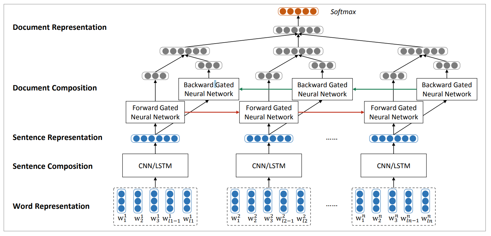
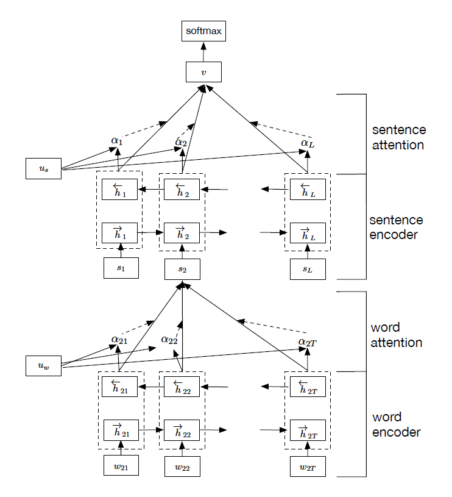
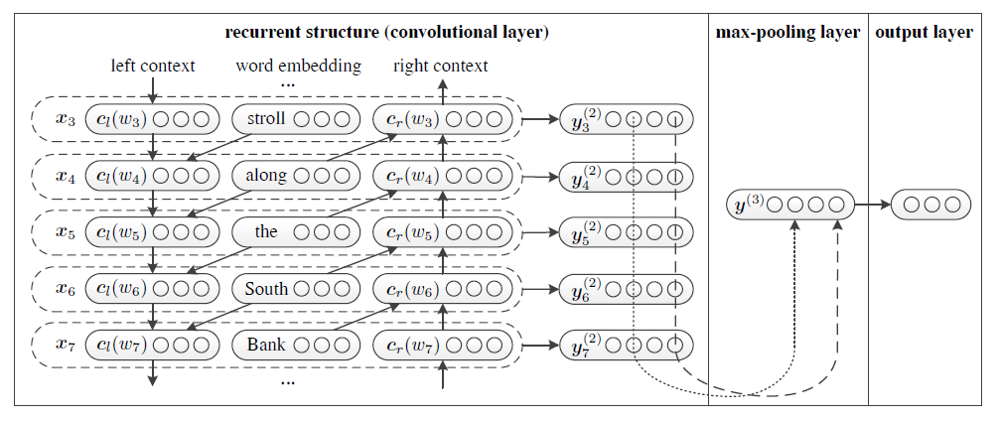
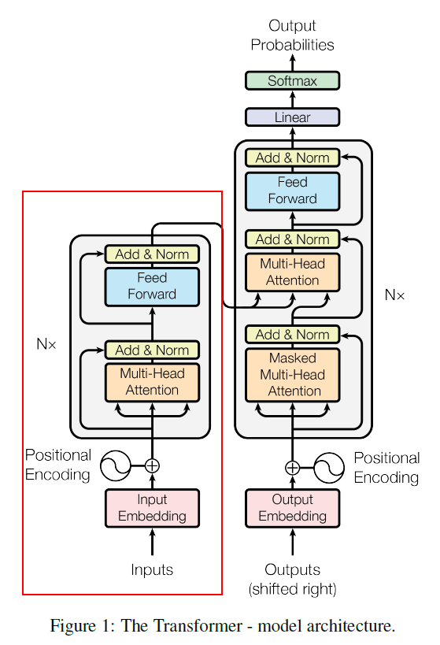

# Deep Learning Text Classification

Text classification is a fundamental task in Natual Language Processing. The goal of text classification is to assign labels to text. Traditional approaches of text classification attempt to map text into a fixed vector, such as tfidf, and then classify it to one class or more than one.

In this repository, I focus on deep learning methods in text classification field. Deep learning method, such as CNN, LSTM, MemNN, .etc , have been broadly used in text representatation learning. We can finally classify text according to the representation. 

## Environment

- tensorflow 1.12.0
- python 3.5
- pandas
- numpy
- nltk

## Datasets

### Overview

|Dataset| Introduction|
|---|---|
|IDBM|       |
|AG News|    |

### IMDB

This is a dataset for binary sentiment classification containing substantially more data than previous benchmark datasets. We provide a set of 25,000 highly polar movie reviews for training, and 25,000 for testing. There is additional unlabeled data for use as well. Raw text and already processed bag of words formats are provided. See the README file contained in the release for more details.

Related url:

[1] http://ai.stanford.edu/~amaas/data/sentiment/

### Rt-polarity 

This dataset is a sentence level movie review dataset which consist of 5331 positive sentences and 5331 negivate sentences. It was introduced in Pang/Lee ACL 2005. Released July 2005.

sentence polarity dataset v1.0

Related url:

[1] http://www.cs.cornell.edu/people/pabo/movie-review-data/

### DBpedia ontology

40,000 training samples and 5,000 testing samples from 14 nonoverlapping classes from DBpedia 2014. For each class, there are 40,000 training samples and 5,000 testing samples.

Related url:

[1] 

### AG News

AG News is a news articles dataset which collected from more than 2000 news sources.This dataset has  4 classes and only the title and description fields are used.The number of training samples for each class is 30,000 and testing 1900.

I download this dataset from fast.ai for my experiemnt.

Related url:

[1] https://course.fast.ai/datasets.html

[2] https://www.di.unipi.it/~gulli/AG_corpus_of_news_articles.html

### TREC

### Sentihood

### SST-2

### Yelp

Related url:

[1] https://www.yelp.com/dataset/challenge

### TODO 

add dataset : Yahoo answers、Amazon reviews.

## Models

In the text classification task, the most common model is textcnn, textrnn, textcnn + attention and textrnn + attention, fasttext etc.

### TextCNN

#### Implement reference

[1] https://github.com/cmasch/cnn-text-classification/blob/master/cnn_model.py

### TextRNN

### LSTM_GRNN

[1] Duyu Tang .etc, "Document Modeling with Gated Recurrent Neural Network for Sentiment Classification." ACL'2015

### HAN

Related paper:

[1] Zichao Yang .etc, "Hierarchical Attention Networks for Document Classification." 

### RCNN

Implement reference：

[1] https://github.com/roomylee/rcnn-text-classification

### Dynamic Memory Network

### Transformer's Encoder

Transformer is proposed by google in the paper of "Attention is all you need".In this text classification task, we only use the encoder of Transformer to learn a text representation.

Implement reference:

[1] https://github.com/Lsdefine/attention-is-all-you-need-keras

### Google Universal Sentence Encoder

### BERT

## Experiment

### TextCNN

| Dataset | Training(acc) | Validation(acc) | Test(acc) |
|---|---|---|---|
| IMDB(no data proprecess) | 0.9453 | 0.9052 | 0.9006 |
| AG News  | 0.9455   |  0.9250 | 0.9261 |

### TextRNN

| Dataset | Training(acc) | Validation(acc) | Test(acc) |
|---|---|---|---|
| IMDB(no data preprocess) | 0.9352 | 0.9026 | 0.9110 |
| AG News  |  /   |  /  |  /  |

## TODO

- add more dataset

- add more model

## Reference

[1] http://nlpprogress.com/english/sentiment_analysis.html

[2] https://www.jiqizhixin.com/articles/2018-10-23-6 

[3]

[4] 

