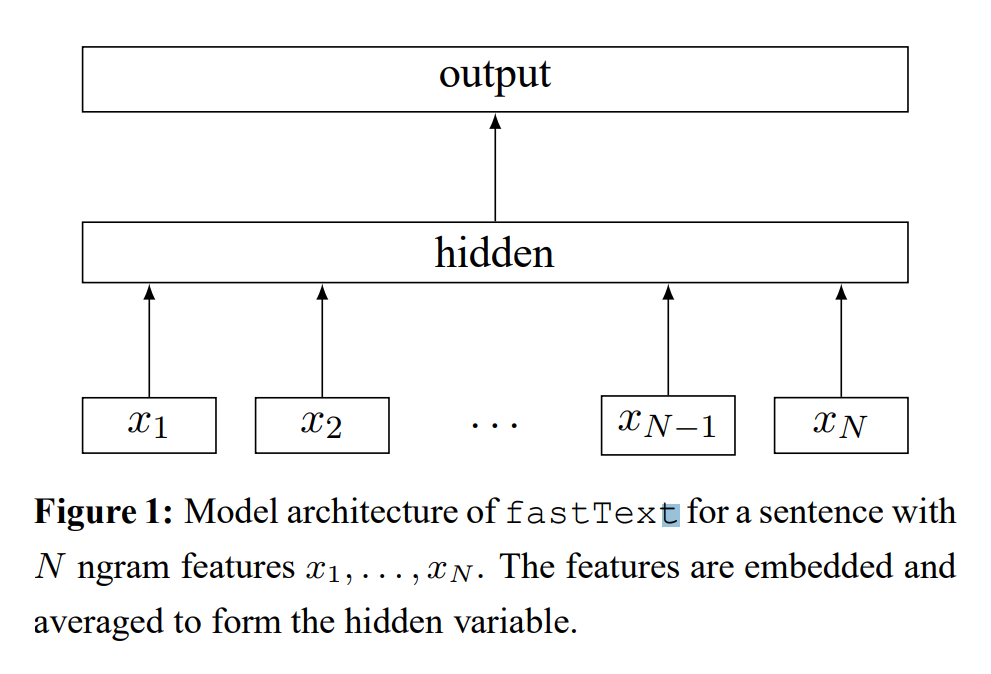
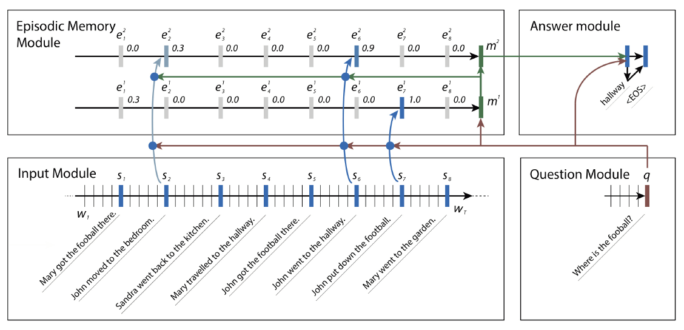
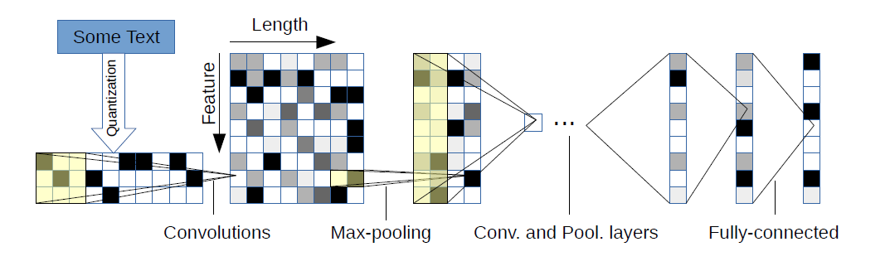
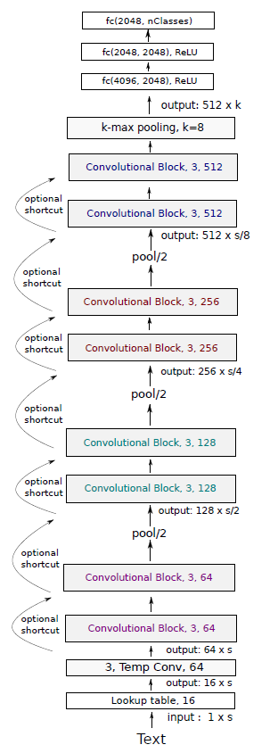
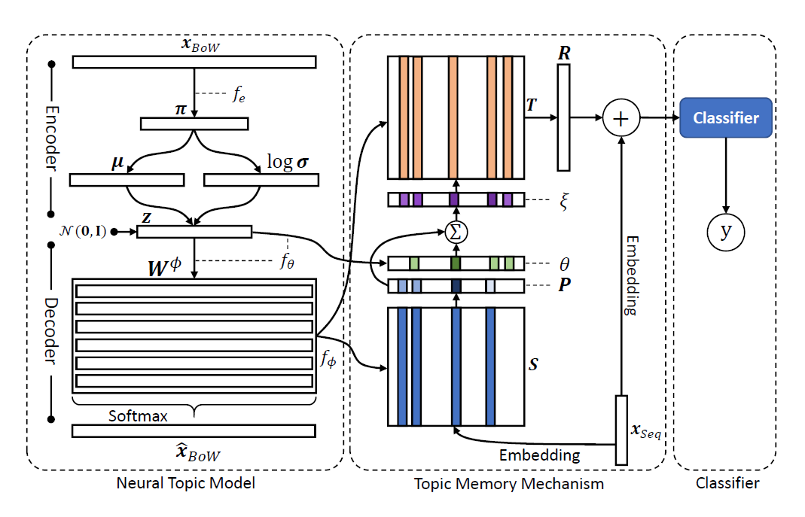
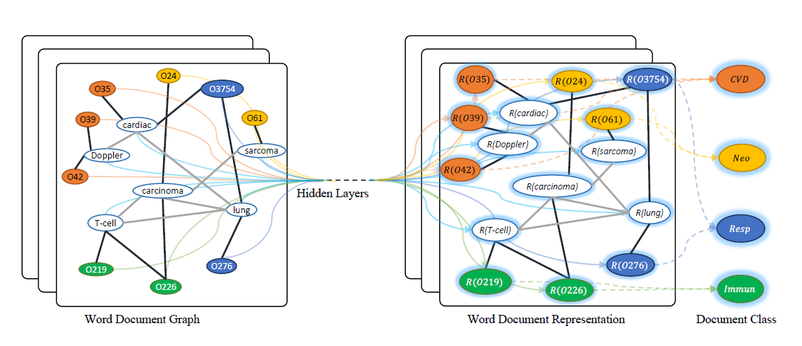

# Deep Learning Text Classification

Text classification is a fundamental task in Natual Language Processing. The goal of text classification is to assign labels to text. Traditional approaches of text classification attempt to map text into a fixed vector, such as tfidf, and then classify it to one class or more than one.

In this repository, I focus on deep learning methods in text classification field. Deep learning method, such as CNN, LSTM, MemNN, .etc , have been broadly used in text representatation learning. We can finally classify text according to the representation. 

## Environment

- tensorflow 1.12.0
- python 3.5
- pandas
- numpy
- nltk

## Models

In the text classification task, the most common model is textcnn, textrnn, textcnn + attention and textrnn + attention, fasttext etc.

### TextCNN

#### Implement reference

[1] https://github.com/cmasch/cnn-text-classification/blob/master/cnn_model.py

### TextRNN

### Fasttext

### LSTM_GRNN

[1] Duyu Tang .et, "Document Modeling with Gated Recurrent Neural Network for Sentiment Classification." ACL'2015

### HAN

Related paper:

[1] Zichao Yang .etc, "Hierarchical Attention Networks for Document Classification." 

### RCNN

Implement reference：

[1] https://github.com/roomylee/rcnn-text-classification

### Dynamic Memory Network

### Char-Level Convolutional Network

### VDCNN

### Transformer's Encoder

Transformer is proposed by google in the paper of "Attention is all you need".In this text classification task, we only use the encoder of Transformer to learn a text representation.

Implement reference:

[1] https://github.com/Lsdefine/attention-is-all-you-need-keras

### Google Universal Sentence Encoder

### TMN (Topic Memory Network)

### TextGCN

## Reference

[1] http://nlpprogress.com/english/sentiment_analysis.html

[2] https://www.jiqizhixin.com/articles/2018-10-23-6 

[3]

[4] 

